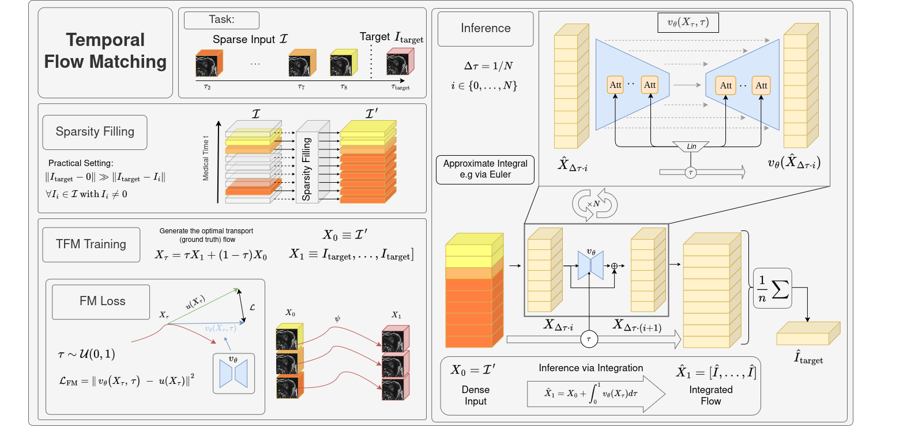

# Temporal Flow Matching

This repository is the official implementation of **Temporal Flow Matching (TFM)**, a spatio-temporal and generative framework for longitudinal medical imaging.   

The method is presented in the paper:
[Temporal Flow Matching for Learning Spatio-Temporal Trajectories in 4D Longitudinal Medical Imaging](https://arxiv.org/abs/2508.21580).

## Features

- Flow Matching for sequence-to-image forecasting.
- Discrete variant (grid-based, e.g. regular follow-up times).
- Supports 3D+T or 4D sequences (e.g. MRI volumes).
- Simple, dependency-light PyTorch code.
- Supports longitudinal and spatio-temporal medical imaging datasets.


## Status

This repository is still WIP. 
Regular updates will follow soon!

## Installation
Clone this repository and install the required packages:
```bash
git clone https://github.com/MIC-DKFZ/Temporal-Flow-Matching.git
cd tfm
pip install -e .
```


## Schematic


## Contact
For further information, or if you want to reach out to us, visit our  [webpage](https://www.dkfz.de/en/medical-image-computing).

## Citation

If you find this work useful for your research, please consider citing:

```bibtex
@misc{disch2025temporalflowmatchinglearning,
      title={Temporal Flow Matching for Learning Spatio-Temporal Trajectories in 4D Longitudinal Medical Imaging}, 
      author={Nico Albert Disch and Yannick Kirchhoff and Robin Peretzke and Maximilian Rokuss and Saikat Roy and Constantin Ulrich and David Zimmerer and Klaus Maier-Hein},
      year={2025},
      eprint={2508.21580},
      archivePrefix={arXiv},
      primaryClass={cs.CV},
      url={https://arxiv.org/abs/2508.21580}, 
}
```